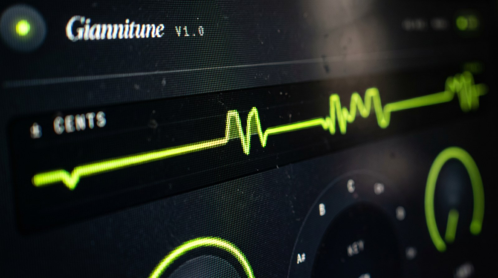
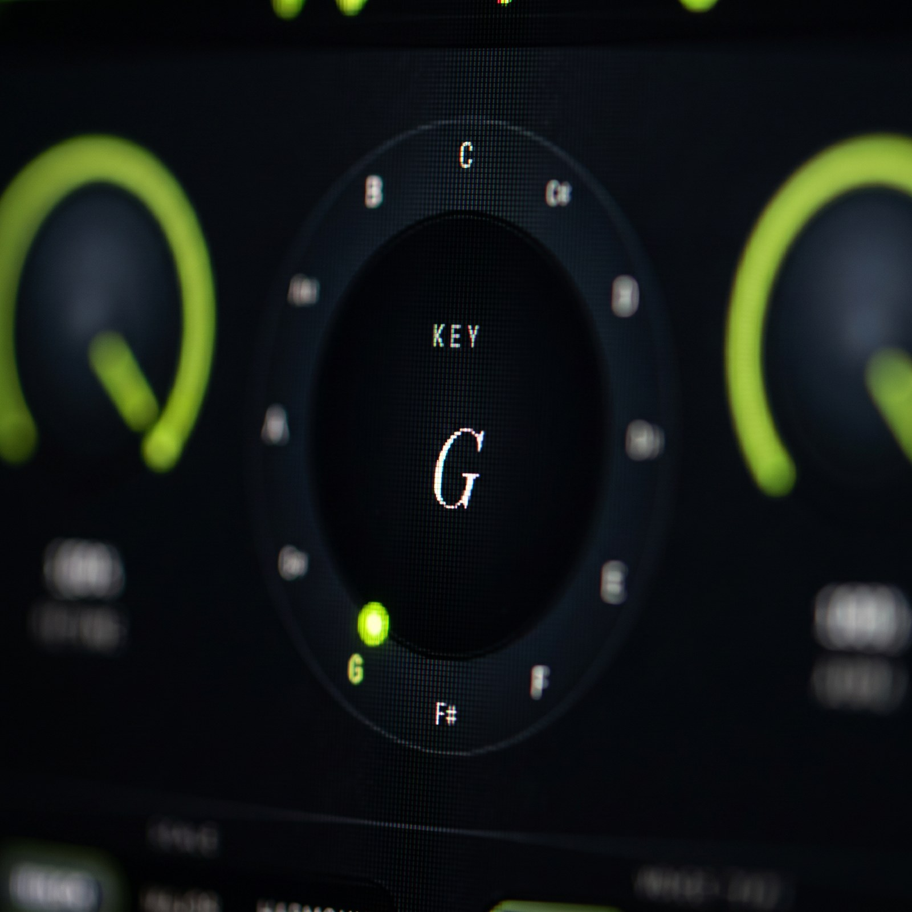

# Giannitune

**Open-source autotune. Pay what you want.**



An independent vocal pitch-correction plugin. No AI fluff, no
subscription, no phone-home. Just a tight, transparent tool that
snaps your vocals to any key in real time — built from scratch and
shipped under AGPL-3.0.

**[→ Download on Gumroad](https://jonnygucci.gumroad.com/l/giannitune)**
· pay what you want (min €0)

---

## What you get

- Real-time pitch correction for any key × scale (major / minor / chromatic)
- One knob to go from a Antares-style transparent correction to full hard-tune
- A second knob ("Aura") for air, presence and crystalline top-end
- Glissando-aware: your natural vocal runs pass through untouched,
  correction kicks back in when you land on a note
- Voice-type presets (Soprano / Alto-Tenor / Low Male) that retune
  the pitch detector to your register
- Works in Ableton Live, FL Studio, Reaper, Logic Pro, Cubase,
  Studio One — anywhere that hosts VST3 or AU
- ~23 ms latency — studio-ready


## Platforms

| | Format | Architecture |
|---|---|---|
| **Windows 10+** | VST3 | x64 |
| **macOS 10.13+** | VST3 + Audio Unit | Universal Binary (Apple Silicon + Intel) |



## Why it exists

Because a plugin that snaps vocals to a scale shouldn't cost €200 +
yearly subscription, and it shouldn't need a cloud account. Antares
Auto-Tune is a great product, but it doesn't have to be the only
option. Giannitune is Jonathan's attempt at a credible alternative —
built in public, shipped as open source, priced by whoever's using it.


## Get it

**[jonnygucci.gumroad.com/l/giannitune](https://jonnygucci.gumroad.com/l/giannitune)**

One installer per platform. Drop it on a vocal track, pick a key,
pull the retune knob. Done.

## Build from source

Requires CMake 3.22+ and a C++17 toolchain (MSVC 2022 on Windows,
Xcode 15+ on macOS). JUCE and Signalsmith Stretch are fetched
automatically on first configure.

```sh
git clone https://github.com/jonnygucci1/Giannitune.git
cd Giannitune
cmake -S . -B build -DCMAKE_BUILD_TYPE=Release
cmake --build build --config Release --target Giannitune_VST3
# macOS adds:
cmake --build build --config Release --target Giannitune_AU
```

Output: `build/Giannitune_artefacts/Release/…`.

## License

AGPL-3.0. Source code is and stays public. Personal, educational,
and commercial use (your own tracks, mixes, releases) are all
unrestricted — what you ship stays yours. If you modify the plugin
itself and redistribute the modified version, those changes must be
published under AGPL-3.0 too.

For a non-AGPL commercial licensing arrangement (embedding in a
closed-source product), open a GitHub issue.

---

© 2026 Jonathan Griessl. AGPL-3.0.
